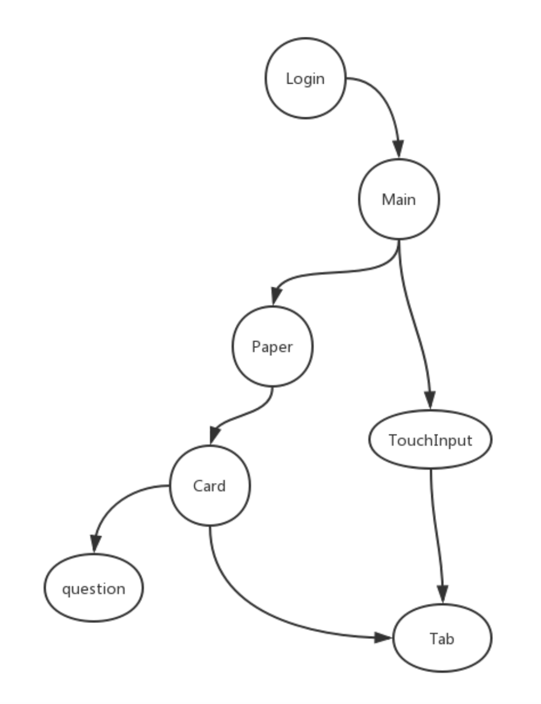
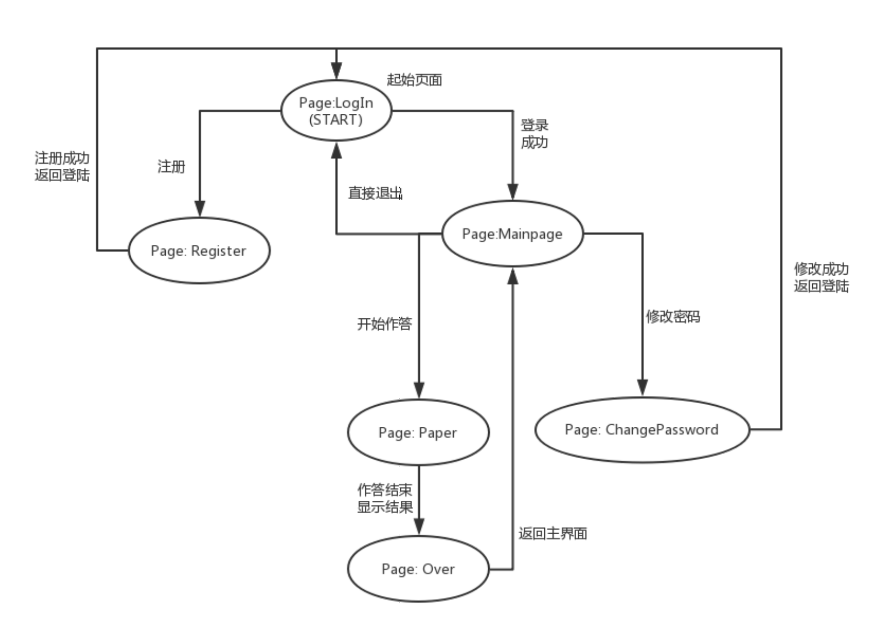

## ATPGS - Automatic-test-paper-generation-system

项目链接：

[https://github.com/qkuns/ATPGS](ATPGS——自动生成题目练习系统)


### Notice

**运行失败**、**运行出错**或**环境配置**等问题请联系：

qkuns@qq.com（329秦）


测试账号（也可以手机注册）

账号 `dev`

密码 `111`


与本文件同一目录下有调试视频。


### 背景

结对编程项目。

~~短信余量只剩220条了~~。


### 项目需求

**带UI的小初高数学学习软件（自动生成题目练习）**

- 页面
  - [x] 注册
  - [x] 登录
  - [x] 登录状态下的做题选项
  - [x] 修改密码
  - [x] 题目练习
- 注册功能（提供手机号，收到注册码，验证注册）
  - [x] 提供手机号，返回注册码
  - [x] 检查是否重复
  - [x] 注册码验证
  - [x] 验证成功后设置密码，密码需要两次输入
  - [x] 密码格式验证（6-10位，必须含大小写字母和数字）
- 登录状态
  - 修改密码
    - [x] 需要正确输入原密码
    - [x] 两次输入新密码且符合格式，如上
    - [x] 显示修改成功
  - 做题练习
    - [x] 选项有小初高三个
    - [x] 然后选择题目数量
    - [x] 生成题目：同个人项目
    - [x] 生成试卷，每次显示一道题
    - [x] 选好后点击下一题相当于提交，~~没选提醒~~**改为了默认选A**
    - [x] 最后一题提交完给出分数
    - [x] 回到做题系统首页
- 重构代码 ~~(以后有空的话)~~
  - [ ] 数据管理使用`redux`
  - [ ] 代码冗余部分
  - [ ] 题目生成部分
  - [ ] `css-in-js`代码冗余，可用`webpack`抽离出来使用`sass`写
  - [ ] `<TouchableOpacity/>`按钮封装成组件

### 开发环境依赖

1. Node

   `brew install node`

2. Watchman

   `brew install watchman`

3. React Native脚手架

   `npm install -g react-native-cli`

4. React Native 路由

   1. `yarn add react-navigation`

   2. `yarn add react-native-reanimated react-native-gesture-handler react-native-screens@^1.0.0-alpha.23`

   3. `cd ios`

   4. `pod install`

5. 运行应用，ios应用必须在macOS下运行

   `react-native run-ios`

6. 调试环境

   `yarn add react-devtools`

### 如果是克隆下来的话

`react-native`是支持跨平台开发，但是本引用中使用了部分仅支持iOS的组件，所以本app只能在iOS或iOS模拟器中正常运行。

~~没做适配，并且（可能）只支持iOS 12.4，iPhone X。~~

1. 安装依赖

   `yarn install`

2. 安装Cocoapods

      `cd ios`      先进入ios文件夹

      `sudo gem install cocoapods`   安装`cocoapods`

      `pod install`

3. 运行

      `react-native run-ios`


### 路由配置

```js
//移除所有header，禁用了所有手势
const AppNavigator = createStackNavigator(
  {
    Home:{
      screen: Login,
      navigationOptions: {
        header: null,
        gesturesEnabled: false
      }
    },
    Main:{
      screen: Main,
      navigationOptions: {
        header: null,
        gesturesEnabled: false
      }
    },
    Reg:{
      screen: Register,
      navigationOptions: {
        header: null,
        gesturesEnabled: false
      }
    },
    ChangePwd: {
      screen: ChangePwd,
      navigationOptions: {
        header: null,
        gesturesEnabled: false
      }
    },
    Paper: {
      screen: Paper,
      navigationOptions: {
        header: null,
        gesturesEnabled: false,
      }
    },
    Over: {
      screen: Over,
      navigationOptions: {
        header: null,
        gesturesEnabled: false,
      }
    }
  },
  {
    initialRouteName: 'Home',
  },
);

const AppContainer = createAppContainer(AppNavigator);

export default class App extends Component {
  render() {
    return <AppContainer />
  };
}
```

### 组件通信

**（有时间使用`redux`重构一下，组件通信在代码中显得过于繁琐）**



### 页面逻辑



### 预览
在`github`里被ignore了……
